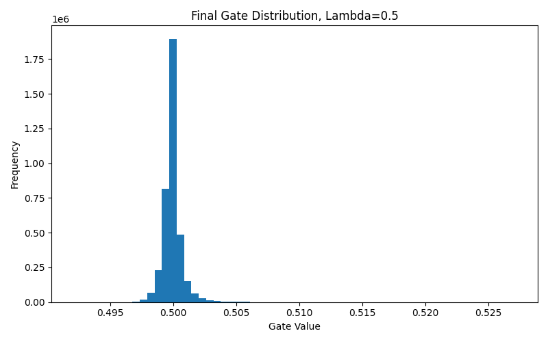
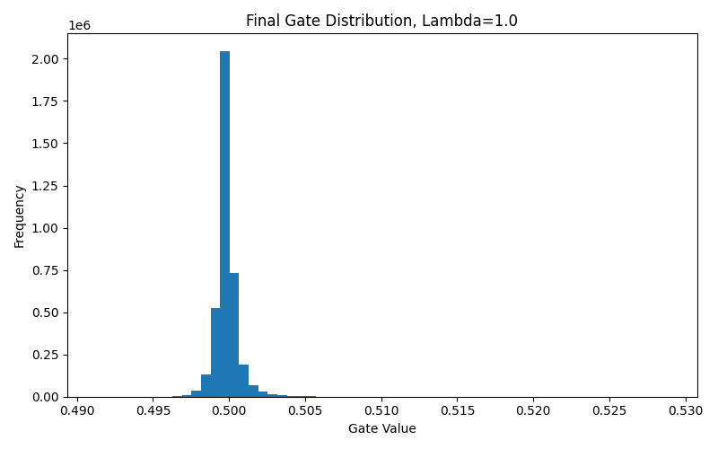
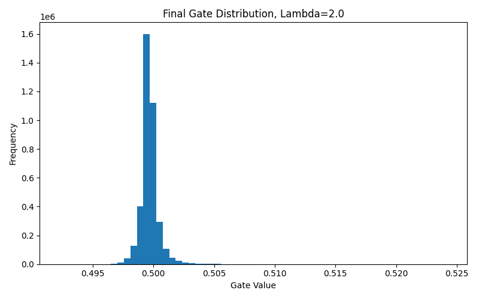
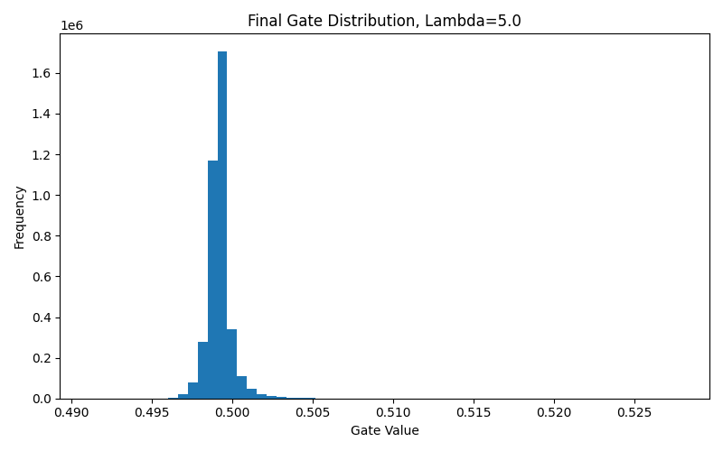

# 🚀 Self-Pruning Neural Network (CIFAR-10)

---

## 📌 Overview

In this project, I implemented a **self-pruning neural network** that learns to remove unnecessary connections during training itself.

Instead of training a large model and pruning it later, the network is designed to:

- Learn classification  
- Learn model compression  

**at the same time**

---

## 🧠 Problem Statement

Neural networks are often over-parameterized, which leads to:

- High memory usage  
- Slower inference  
- Inefficiency in deployment  

The goal of this project is to build a model that can:

> Automatically identify and suppress unimportant weights during training.

---

## ⚙️ Project Workflow

### Step 1: Data Preparation
- Dataset: CIFAR-10  
- 10 classes (airplane, car, dog, etc.)  
- Images normalized using torchvision transforms  

Due to CPU constraints, a subset of **12,000 samples** was used.

---

### Step 2: Custom Layer Design

I implemented a custom layer called:

### 🔹 PrunableLinear

Each weight has a learnable gate: effective_weight = weight × sigmoid(gate_score)

- Gate ≈ 1 → connection active  
- Gate ≈ 0 → connection pruned  

---

### Step 3: Model Architecture

The model is a feedforward neural network:
Input → FC → BN → ReLU → Dropout → FC → BN → ReLU → FC → Output

Key components:
- Batch Normalization (stability)
- Dropout (regularization)
- Custom pruning layers

---

### Step 4: Loss Function
Total Loss = CrossEntropyLoss + λ × SparsityLoss

Where:
SparsityLoss = mean(sigmoid(gate_scores))

- CrossEntropy → classification  
- SparsityLoss → pushes gates toward zero  

---

### Step 5: Training Process

- Optimizer: Adam  
- Learning rate: 1e-3  
- Epochs: 4  
- Batch size: 128  

During training:
- Model learns weights  
- Model learns which connections to prune  

---

### Step 6: Sparsity Calculation

Since sigmoid outputs are continuous:
Gate < 0.5 → considered pruned

---

## 📥 Input & 📤 Output

### Input
- CIFAR-10 images (32×32 RGB)
- Labels (10 classes)

### Output
- Predictions  
- Gate values  
- Sparsity percentage  

---

## 📊 Results

| Lambda | Accuracy (%) | Sparsity (%) |
|--------|-------------|-------------|
| 0.5 | 43.11 | 62.48 |
| 1.0 | 41.20 | 69.71 |
| 2.0 | 42.05 | 79.06 |
| 5.0 | 42.71 | 91.44 |

---

## 📈 Observations

- Increasing λ increases sparsity  
- Model prunes up to **91% connections**  
- Accuracy remains stable (~41–43%)  

This confirms:
λ ↑ → Sparsity ↑ → Accuracy slightly ↓

---

## 📊 Result Visualizations

### 🔹 Training Logs
👉 *(Paste your screenshot here)*

### 🔹 Gate Distribution
👉 *(Add your images below)*

---

## 🧠 Key Insights

- Model learns which connections matter  
- Pruning happens during training  
- High sparsity with acceptable accuracy  

---

## 🎯 Why This Approach is Useful

Traditional approach:
Train → Prune → Fine-tune

This approach:

Train + Prune simultaneously

Benefits:
- Faster pipeline  
- Better optimization  
- Deployment-friendly  

---

## ⚡ How to Run

### Install dependencies

pip install -r requirements.txt

### Run training

python train_self_pruning_cifar10.py --epochs 4 --subset 12000 --lambdas 0.5 1.0 2.0 5.0 --threshold 0.5
---

## 🏗️ Project Structure

self-pruning-neural-network/
├── train_self_pruning_cifar10.py
├── requirements.txt
├── README.md
├── .gitignore
└── results/

---

##  Conclusion

This project shows that neural networks can:

> Learn both performance and compression together.

This is useful for:
- Edge AI  
- Low-memory systems  
- Efficient deployment  

---

## 👤 Author

**Karbari Divya
**

---
